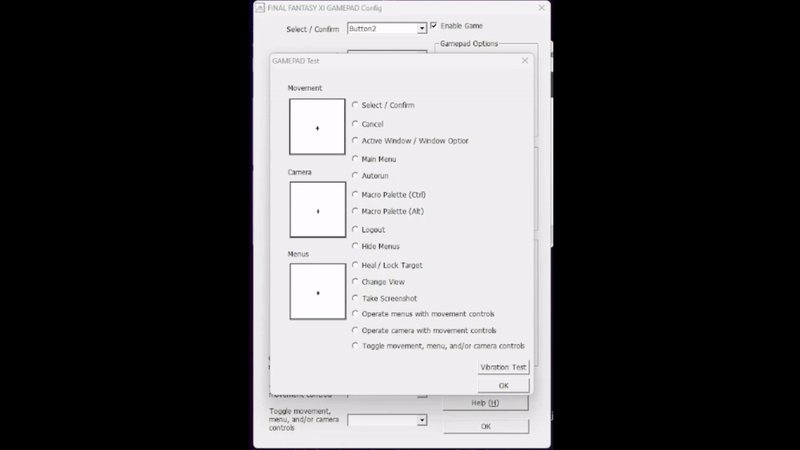

[Home](readme.md)

# Controller Setup
1. Open the launcher
2. Go to settings in the launcher
3. Open Gamepad Config
4. Check box Enable Game
5. Based off the controller you're using you'll check certain options
  * If PS4/PS5 then enable hat switches
  * If Xbox then enable XInput
6. In an effort to have our buttons be similar, I'm going to have you change a few
	1. Click on the drop down for Active Window / Window Options then press either Square (on PS4/PS5 Controllers) or X (on Xbox controllers)
	2. Click on the drop down for Main Menu then press either Triangle (on PS4/PS5 Controllers) or Y (on Xbox controllers)
7. We'll test our controller to see if it works now, click on Test Gamepad
8. Go through each of your buttons on your controller and see if they activate, you'll be able to tell this based off of the little circles next to the corresponding text
9. Try moving your left stick, it should only move the plus symbol in the highest box
10. Now try moving your right stick, it should only move the plus symbol in the middle box

12. Finally, try using your d-pad, it should move the plus symbol in the lowest box
	* If one or none of these moved then we'll have to fix that
		1. Hit OK
		2. Under the section Directional Control Devices click on Movement
		3. Follow the on screen prompts, you'll use the left stick for movement
			* Button 1 on PS4/PS5 is Square
		4. Once you've finished calibration of your Movement stick (left stick) then click on Camera and follow the on screen prompts
		5. After you finish calibration of your Camera stick (right stick) then click Menus (this will calibrate your d-pad)
	* Go back to Test Gamepad and see if what we've done has made any difference by testing your left (movement) and right (camera) sticks and your d-pad (menus)
	* If none of these work, just ask for my help we'll figure it out together